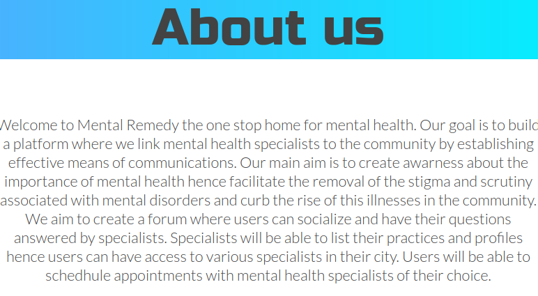

# Mental Remedy

A Product for findind innovative ways that can link mental health specialists to your community. Check it out [here](https://mental-remedy.netlify.app/)

## About

Welcome to Mental-Remedy, team-158's project based on the sustainable development goals solution to promoting good health and well-being by linking mental health specialists to our community.

## Why

Mental health problems appear to be increasing in importance in Africa. Between 2000 and 2015 the continent's population grew by 49%. As Africa's population is expected to double over the next three decades, the pressures on young people in particular, who across the region are already struggling to earn a livelihood in highly competitive labour markets, are likely to ratchet up. Many will experience psychological problems as they fail to realise their ambitions, and some will turn to substance misuse as a means of alleviating their frustration.

Increased attention to mental health by governments, researchers, and journals is therefore essential.This project tackles the third sustainable development goal of good health and well-being by linking mental health specialists to our communities. Mental illness is stigmatized in our communities which has reduced health-seeking behaviour among those affected. People fail to realize that mental illness is an health condition of the mind which changes thinking, emotions and behaviour. With proper treatment, mentally ill individuals can return back to their communities and contribute meaningfully to the society. Our project aims to facilitate the process of getting health care at the community level.

## Usage

Click [here](https://mental-remedy.netlify.app/) to directed to our site. Browse through to see the services we offer, check out the Forum to view Posts and Comments concerning mental health and login or signup to post, comment and book appointments.

## Setup

Install `npm` or `yarn` if you dont have any of them already installed. We recommend Yarn though.

After clonning the repo to your local machine and moving into the cloned folder, Run `yarn install` to get started by installing dependencies.

`src/index.js` is the entry to the project and source code should go into the `src` folder.

All tests should be named after their corresponding components. e.g for `App.js` test file will be `App.test.js`

This starter uses [Parcel](https://parceljs.org/getting_started.html) as the bundler. It is much simpler than WebPack and the others.

### Hints

-   Run `npm install` or `yarn install` to get started. We'll assume you are using Yarn.
-   Install additional dependencies: `yarn add <dependency-name> [-D]`
-   Run tests: `yarn test`
-   Run tests with test coverage info: `yarn test:cover`
-   Check the codebase for proper syntax and formatting compliance: `yarn lint`
-   Run your app in local dev mode: `yarn start`. This puts the bundled app in a `dist` folder, set up a local web server at localhost:1234, and continues to watch for your code changes which it syncs with the local server. This means if you loaded the app in a browser, it will auto-refresh as you code along. Feel free to use whatever bundler best meets your needs. Parcel was only added as a sample and for those looking for a simple but effective solution to the hassle of bundlers.

## Authors

Abdulwadud Haji - [art-abdulwadud](https://github.com/art-abdulwadud) - Team Technical Lead, Frontend Lead, UI/UX Designer

Abdullahi Hassan - [art-abdullahi](https://github.com/art-abdullahi) - Frontend Engineer, UI/UX Designer

Brandon Shumba - [BranTkS](https://github.com/BranTkS) - Frontend Engineer, UI/UX Designer

Hammed Noibi - [hnobi](https://github.com/hnobi) - Mentor

## Contributing

If this project sounds interesting to you and you'd like to contribute, thank you!
First, you can send a mail to buildforsdg@andela.com to indicate your interest, why you'd like to support and what forms of support you can bring to the table, but here are areas we think we'd need the most help in this project :

1.  Video visits (e.g Creating a feature for allowing patients to have online visits with the specialists)
2.  Content (e.g Much more research is needed for creating more content about mental health)

## Acknowledgements

We would like to acknowledge the Lancet Global Health for providing us with the statistics on the mental health in africa.
And also our dear friends at andela for giving us this oppurtunity to become part of the solution to a major issue facing our community.

## LICENSE

MIT
